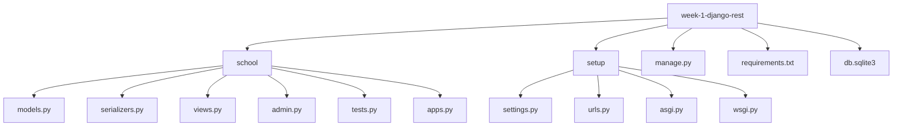

# week-1-django-rest


A well-structured REST API for managing school resources, implemented using Django and Django REST Framework.  
This project demonstrates clean architecture, organized app structure, and application of best practices in API development.

---

## Overview

The API provides endpoints to manage core school entities including **Students**, **Courses**, and **Enrollments**.  
The project follows Django conventions with a dedicated app for models, serializers, and views, as well as a clean project configuration.

Key highlights:

- Organized Django app structure with separation of concerns
- Use of DRF ViewSets and Routers for scalable REST endpoints
- Proper model relationships, validations, and serializers
- Prepared for extension and integration with authentication/permissions

---

## Project Structure

- **school/** – Main application containing models, serializers, views, and tests
- **setup/** – Project configuration (settings, URLs, WSGI/ASGI)
- **manage.py** – Django management utility
- **requirements.txt** – Project dependencies
- **db.sqlite3** – SQLite database for development

---



---

## Running the Project

1. Clone the repository:
   ```bash
   git clone https://github.com/FernandaIshida/dev-journey.git
   cd dev-journey/week-1-django-rest

2. Install dependencies:
   ```bash
   pip install -r requirements.txt

3. Apply migrations:
   ```bash
    python manage.py migrate

4. Run the development server:
   ```bash
   python manage.py runserver

Visit: http://localhost:8000/

| Method    | Endpoint          | Description              |
| --------- | ----------------- | ------------------------ |
| GET       | `/students/`      | List all students        |
| POST      | `/students/`      | Create a new student     |
| GET       | `/students/<id>/` | Retrieve a student by ID |
| PUT/PATCH | `/students/<id>/` | Update student data      |
| DELETE    | `/students/<id>/` | Remove a student         |
| GET       | `/courses/`       | List all courses         |
| POST      | `/courses/`       | Create a new course      |
| GET       | `/courses/<id>/`  | Retrieve a course by ID  |
| PUT/PATCH | `/courses/<id>/`  | Update course data       |
| DELETE    | `/courses/<id>/`  | Remove a course          |

## Contributing

This project is maintained professionally and open to contributions via **issues** or **pull requests** .
Please follow the project conventions when extending models or API functionality.

## License

MIT License
